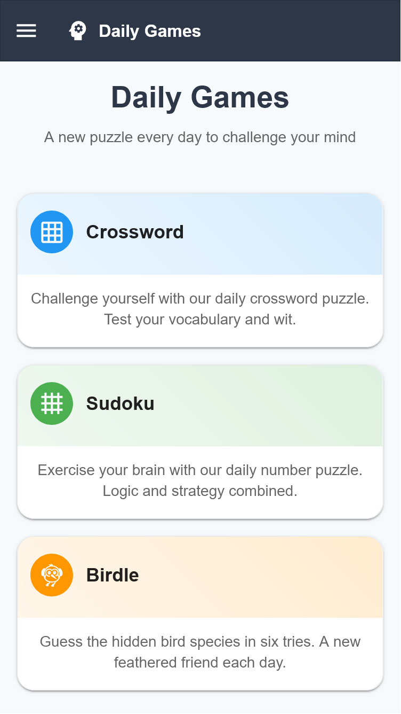
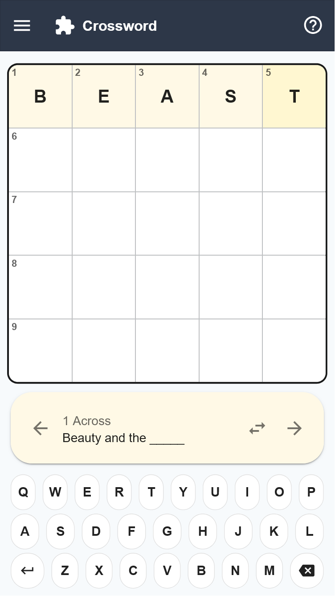
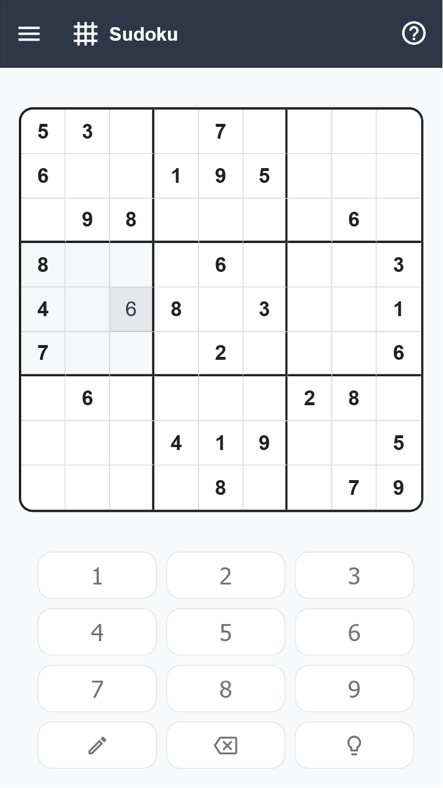
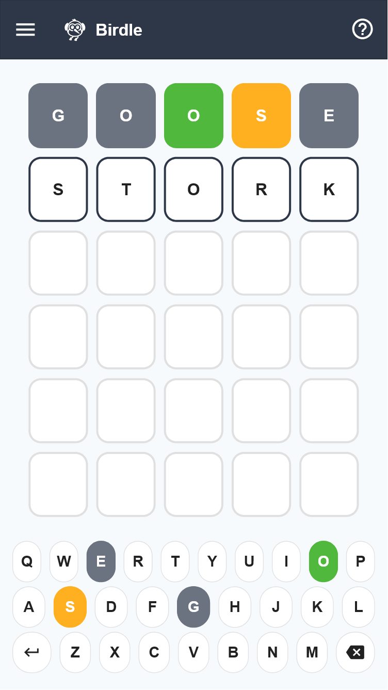

# Daily Games

A modern, responsive web application featuring a collection of daily word and number puzzles. Built with React, TypeScript, and Material-UI, this project showcases clean design and engaging gameplay while serving as an experimental exercise in AI-assisted development.

🎮 **[Play Daily Games](https://mchartier.github.io/daily-games)** - Try it out on GitHub Pages!

## 📸 Screenshots

### Home Screen

*The main dashboard showcasing all available games with their beautiful card layouts*

### Games in Action
<div style="display: flex; gap: 10px; margin-bottom: 20px;">
    <div style="flex: 1;">
        
        <em>Crossword - A compact 5x5 puzzle</em>
    </div>
    <div style="flex: 1;">
        
        <em>Sudoku - Classic number puzzle</em>
    </div>
    <div style="flex: 1;">
        
        <em>Birdle - Bird-themed word game</em>
    </div>
</div>

## 🎮 Featured Games

### Crossword
A compact 5x5 crossword puzzle that challenges players with clever clues and interconnected answers. Perfect for a quick mental workout during your coffee break.

### Sudoku
The classic number placement puzzle, featuring a clean interface and intuitive controls. Complete with note-taking functionality and helpful hints when you need them.

### Birdle
A bird-themed word guessing game inspired by Wordle. Try to guess the 5-letter bird name in six attempts or less, with color-coded feedback to guide your choices.

## 🚀 Getting Started

### Prerequisites
- Node.js (v14 or higher)
- npm or yarn

### Installation

1. Clone the repository:
```bash
git clone https://github.com/yourusername/daily-games.git
cd daily-games
```

2. Install dependencies:
```bash
npm install
# or
yarn install
```

3. Start the development server:
```bash
npm start
# or
yarn start
```

4. Open [http://localhost:3000](http://localhost:3000) to view it in your browser.

## 🛠️ Built With

- [React](https://reactjs.org/) - Frontend framework
- [TypeScript](https://www.typescriptlang.org/) - Type safety and enhanced developer experience
- [Material-UI](https://mui.com/) - UI component library
- [React Router](https://reactrouter.com/) - Navigation and routing

## 🤖 AI-Assisted Development

This project serves as an experimental exercise in leveraging AI code generation tools to rapidly prototype and iterate on new ideas. The development process utilized:

- **Claude AI** - For generating initial component structures and game logic
- **GitHub Copilot** - For real-time code suggestions and completions
- **Cursor IDE** - For AI-powered code editing and refactoring

The AI-assisted approach allowed for:

- Rapid prototyping of game mechanics
- Quick iteration on UI/UX designs
- Efficient problem-solving for complex game logic
- Consistent code style and patterns across components

This experimental approach demonstrated how AI tools can significantly accelerate the development process while maintaining code quality and architectural consistency. The human developer's role focused on:

- High-level architecture decisions
- Game design and user experience
- Code review and quality assurance
- Performance optimization
- Feature prioritization

## 📱 Features

- Responsive design that works on both desktop and mobile devices
- Clean, modern UI with consistent styling across games
- Progress tracking and statistics for each game
- Helpful tutorials and "How to Play" guides
- Keyboard support for all games
- Dark mode support

## 🤝 Contributing

Contributions are welcome! Feel free to open issues or submit pull requests.

## 📝 License

This project is licensed under the MIT License - see the [LICENSE](LICENSE) file for details.

## 🙏 Acknowledgments

- Inspired by popular word and number puzzles
- Built with the assistance of AI tools and the open-source community
- Special thanks to all contributors and testers
